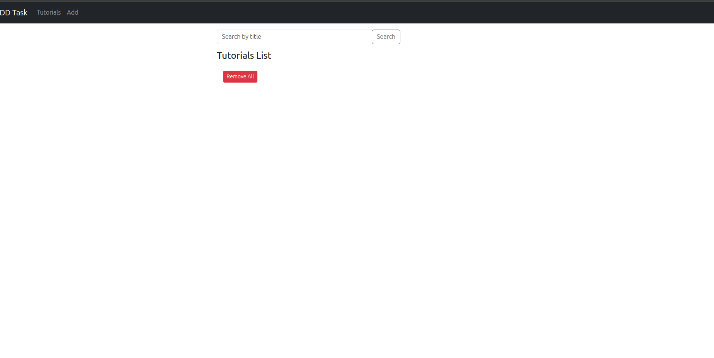

# MEAN Stack CRUD Application with CI/CD Pipeline

[](https://github.com/thisis-gp/crud-task-mean-app/actions)

A full-stack MEAN (MongoDB, Express, Angular, Node.js) application with Docker containerization and CI/CD pipeline implementation.

## Table of Contents
- [Features](#features)
- [Prerequisites](#prerequisites)
- [Local Development Setup](#local-development-setup)
- [Deployment](#deployment)
- [CI/CD Pipeline](#cicd-pipeline)
- [Screenshots](#screenshots)

## Features
- Create, Read, Update, Delete Tutorials
- Angular 15 frontend
- Node.js/Express backend
- MongoDB database
- Docker containerization
- CI/CD with GitHub Actions
- Nginx reverse proxy

## Prerequisites
- Node.js v18+
- Angular CLI v15+
- Docker v20.10+
- Docker Compose v2.12+
- AWS Account (for deployment)
- MongoDB 6.0+

## Local Development Setup

### 1. Clone Repository
```bash
git clone https://github.com/thisis-gp/crud-task-mean-app.git
cd crud-task-mean-app
```

### 2. Backend Setup
```bash
cd backend
npm install
# Configure MongoDB in config/db.config.js
node server.js
```

### 3. Frontend Setup
```bash
cd frontend
npm install
# Configure API endpoint in src/app/services/tutorial.service.ts
ng serve
```

### 4. Access Application
-   Frontend: `http://localhost:4200`

-   Backend API: `http://localhost:8080/api/tutorials`

## Deployment

### 1. Docker Setup
```bash
docker-compose build
docker-compose up -d
```

### 2. AWS EC2 Deployment

1.  Create t3.micro EC2 instance

2.  Install Docker and Docker Compose

3.  Clone repository

4.  Run `docker-compose up -d`

## CI/CD Pipeline

### GitHub Actions Workflow
```yaml
name: Deploy MEAN Stack

on:
  push:
    branches: [main]

jobs:
  build-and-push:
    runs-on: ubuntu-latest
    steps:
    - name: Checkout code
      uses: actions/checkout@v4

    - name: Login to Docker Hub
      uses: docker/login-action@v3
      with:
        username: ${{ secrets.DOCKERHUB_USERNAME }}
        password: ${{ secrets.DOCKERHUB_TOKEN }}

    - name: Build and Push Backend
      uses: docker/build-push-action@v5
      with:
        context: ./backend
        tags: ${{ secrets.DOCKERHUB_USERNAME }}/backend:latest
        push: true

    - name: Build and Push Frontend
      uses: docker/build-push-action@v5
      with:
        context: ./frontend
        tags: ${{ secrets.DOCKERHUB_USERNAME }}/frontend:latest
        push: true

  deploy:
    needs: build-and-push
    runs-on: ubuntu-latest
    steps:
    - name: Configure AWS CLI
      uses: aws-actions/configure-aws-credentials@v4
      with:
        aws-access-key-id: ${{ secrets.AWS_ACCESS_KEY }}
        aws-secret-access-key: ${{ secrets.AWS_SECRET_KEY }}
        aws-region: us-east-1

    - name: Get EC2 IP
      id: get-ip
      run: |
        INSTANCE_IP=$(aws ec2 describe-instances \
          --instance-ids ${{ secrets.EC2_INSTANCE_ID }} \
          --query 'Reservations[0].Instances[0].PublicIpAddress' \
          --output text)
        echo "EC2_HOST=$INSTANCE_IP" >> $GITHUB_ENV

    - name: Deploy to EC2
      uses: appleboy/ssh-action@v1
      with:
        host: ${{ env.EC2_HOST }}
        username: ${{ secrets.EC2_USER }}
        key: ${{ secrets.EC2_SSH_KEY }}
        script: |
          cd ~/crud-task-mean-app
          docker-compose down
          docker-compose pull
          docker-compose up -d
          docker system prune -af
```

### Required Secrets

| Secret Name | Description |
| --- | --- |
| DOCKERHUB_USERNAME | Docker Hub username |
| DOCKERHUB_TOKEN | Docker Hub access token |
| AWS_ACCESS_KEY | AWS IAM access key |
| AWS_SECRET_KEY | AWS IAM secret key |
| EC2_INSTANCE_ID | EC2 instance ID |
| EC2_SSH_KEY | Base64 encoded SSH private key |

## Screenshots


